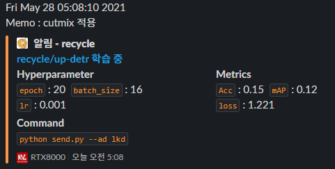
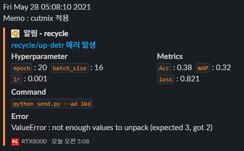
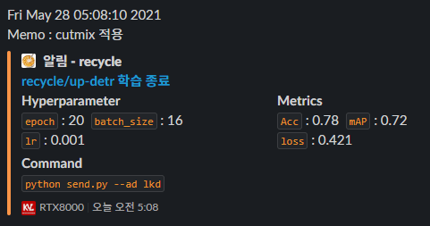

# slackbot
slackbot for DNN training alarm  

## Install 
1. install Slack's SDK
```terminal
$ pip install slack_sdk
```
2. modify values of `'author_icon'` and `'footer_icon'` in `slackbot.py`


## Use
### init slackbot
```python
...

from slackbot import slackAlarm

# for init
token = '[YOUR_SLACK_OAUTH_TOKEN]'
hyper_dict = {'epoch': 100, 'batch_size' : 16, 'lr': 0.001, ... }
url = '[RELATED_URL]'
memo = '[WRITE_SOMETHING]'
channel_name = 'general'

# create instance
slackbot = slackAlarm(token, hyper_dict, url=url, memo=memo)

...
```

###  on training
```python
...
# epochs = 10
metrics_dict = {'Acc':0.15, 'mAP': 0.12, 'loss':1.221, ... }
info = slacker.get_info(epochs, metrics_dict)
slacker.send(channel_name, info)

...
```


### error occured
```python
# epochs = 50
try:
    ...
except BaseException as e:
    metrics_dict = {'Acc':0.38, 'mAP': 0.32, 'loss':0.821, ... }
    info = slacker.get_info(epochs, metrics_dict, error=e)
    slacker.send(channel_name, info)
```


### training end
```python
...
# epochs = 100
metrics_dict = {'Acc':0.78, 'mAP': 0.72, 'loss':0.421, ... }
info = slacker.get_info(epochs, metrics_dict, endTrain=True)
slacker.send(channel_name, info)
```

